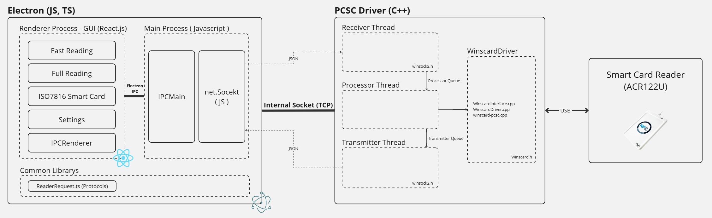

# Scard-Electron-React-App

## 개요
이 프로그램은 **스마트카드 판독기**를 제어하는 Windows Application입니다.

### 기능
- Fast Reading - Mifare Classic 1K 카드를 Default Key(FF or 00)로 리딩

- Full Reading - Mifare Classic 1K 카드를 선택한 Sector와 입력한 Key로 리딩

- ISO7816 Smartcard - ISO14443에서 ISO7816 Smartcard Protocol을 사용하는 카드에게 APDU를 전송 **(수정필요)**

- Settings - 설정, 각 기능 별 테스트

## Usage

## 상세내용
여기서는 Electron.js를 이용한 GUI Application 관련 내용만을 서술합니다.
Winscard.h를 이용한 스마트카드 판독기 조작 관련 내용은 아래 Repo를 참고하시기 바랍니다.
> WinscardDriver : https://github.com/kg3546549/ScardDriver

### Software Architecture

### Electron.js
> https://www.electronjs.org/  
Build cross-platform desktop apps with JavaScript, HTML, and CSS

Electron.js는 HTML, CSS, JS와 같은 기존 Web 기술을 이용하여 크로스 플랫폼 Desktop App 빌드를 지원하는 라이브러리입니다.
기존 웹 지식을 이용하여 간편하게 Desktop App을 제작할 수 있는 장점이 있습니다만, 프로그램 기본 크기가 크다는 단점이 있습니다.

Chromium 기반의 Renderer Process와 node.js 기반의 Main Process가 함께 돌아가기 때문에 시스템 점유율도 높은 편에 속합니다.

#### Renderer Process
이번 프로젝트에서는 React.js와 Chakra UI를 이용하여 View를 구성하였습니다.
React.js와 ChakraUI는 Renderer Process를 통해 화면을 표시합니다.

React.js는 HTML과 CSS를 Javascript를 이용하여 더욱 쉽고 간편하게 조작할 수 있도록 META에서 제작한 라이브러리 입니다. 자세한 내용은 React.js의 홈페이지를 참고하시기 바랍니다.

> https://react.dev/  
React is The library for web and native user interfaces 

Chakra UI는 CSS없이도 간편하게 수려한 디자인의 UI를 개발할 수 있도록 개발된 UI Library 입니다. React와 함께 사용하기에 좋습니다.
자세한 내용은 Chakra UI 홈페이지를 참고하시기 바랍니다.

> https://chakra-ui.com/  
Chakra UI is a component system for building products with speed

위 라이브러리들을 이용하여 프로그램의 GUI를 개발하였습니다.
    

UI에서 스마트카드 판독기를 조작하려
Renderer Process에서 스마트카드 판독기를 직접 조작할 수 있다면 간편하게 개발이 가능했겠지만, 이는 보안상의 문제로 불가합니다.
Renderer Process에서는 오직 Chromium의 DOM에만 접근이 가능합니다.

Electron.js에서 socket, file system 등 Native 기능에 직접 접근하기 위해서는 IPC(Inter-Process Communication) - `ipcRenderer.send()`를 통해 Main Process에게 요청이 필요합니다.

#### Main Process
Main Process는 Windows API를 직접 호출해 수명 주기 관리, Renderer Process 관리 등 여러 프로세스를 실행하고 관리합니다.
특히, Native 기능에 직접 접근이 가능합니다.

IPC를 통해 Renderer Process에게서 요청이 오면 `ipcMain.on()`에서 데이터를 Parsing하여 처리합니다.

하지만 Node.js 환경에서 PC/SC Driver를 직접 호출하는 데에는 한계가 있었습니다.
그래서 저는 C++을 이용하여 하위 프로세스로 동작 할 ScardDriver를 추가로 개발했습니다.

Main Process는 Renderer Process를 실행함과 동시에 하위 프로세스로 ScardDriver를 실행합니다. `winscard-pcsc.exe`

ScardDriver와 Main Process는 Socket을 통해 통신하며 스마트카드 판독기의 제어는 이 프로그램이 맡게 됩니다.

자세한 내용은 https://github.com/kg3546549/ScardDriver Repository에서 확인하시기 바랍니다.

### Pages

#### Full Reading

Mifare Classic 1K 카드를 선택한 Sector와 입력한 Key로 리딩

- Card Status
    - 카드 종류 (ISO14443 A,B Type, Mifare Class 1K ...)
    - UID : 카드별 제조사에서 발급하는 기본 ID
    - SAK : 카드 종류 구분자
    - ATR : 카드 프로토콜 확인 등을 위한 정보
    - ATS : ATR에 포함되어있는 세부 정보
- Sector Data
    - Mifare Classic 1K 카드는 총 16개의 섹터(0~15)를 가지고 있다.
    - 1섹터에는 4개의 Block이 있으며, 가장 마지막 Block은 Key 정보와 접근 제한을 담당하는 Sector Trailor가 있다.
    
- Scan Controls
    - Start Full Scan : Sector Data에서 선택한 섹터들을 Key Settings에 입력한 정보를 이용하여 Reading을 시도한다. 실패 시에는 6300이 출력된다.

- Key Settings
    - Authentication 시에 사용하는 Key Type(A, B)와 Key(6Byte)를 입력한다.
      

#### ISO7816 Smartcard

ISO14443 Type A, B에서 ISO7816 Smartcard Protocol을 사용하는 카드에게 APDU를 전송

ISO7816은 Smartcard 관련된 내용 머시기저시기 